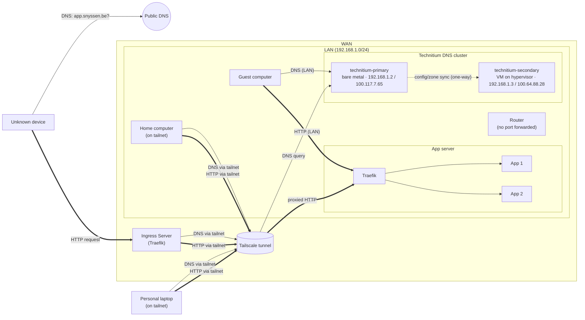
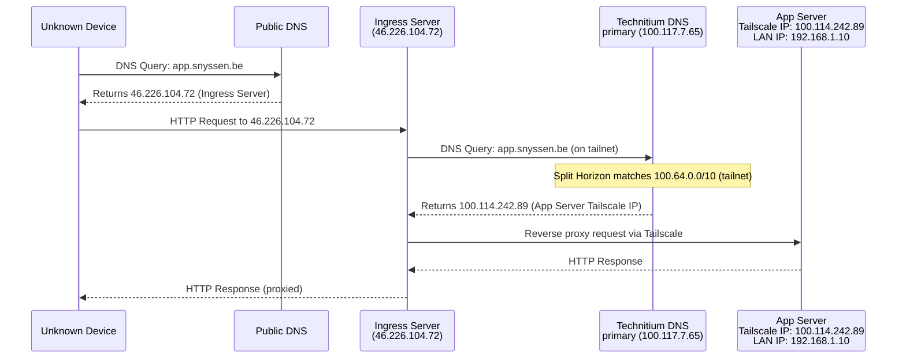
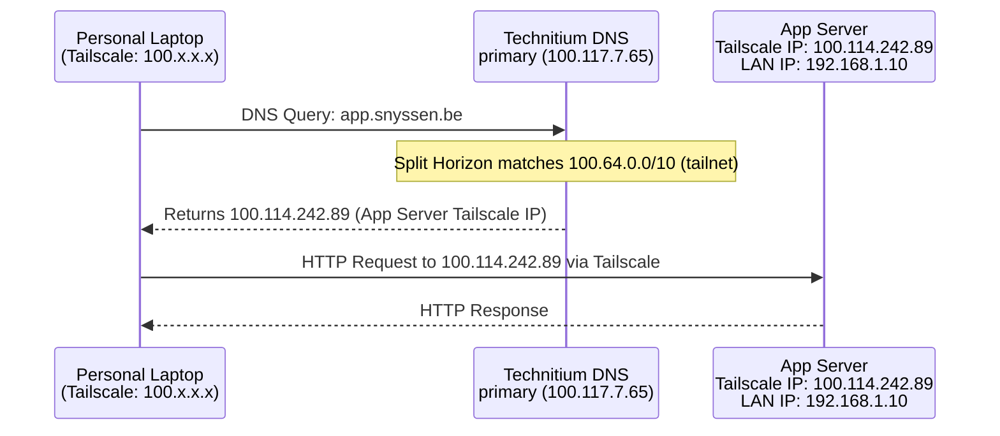
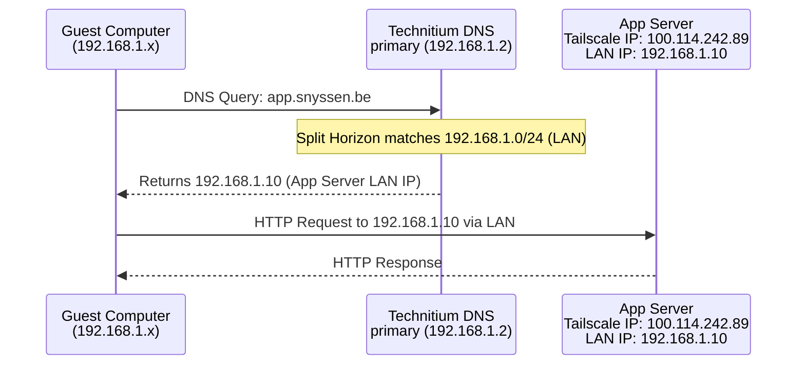
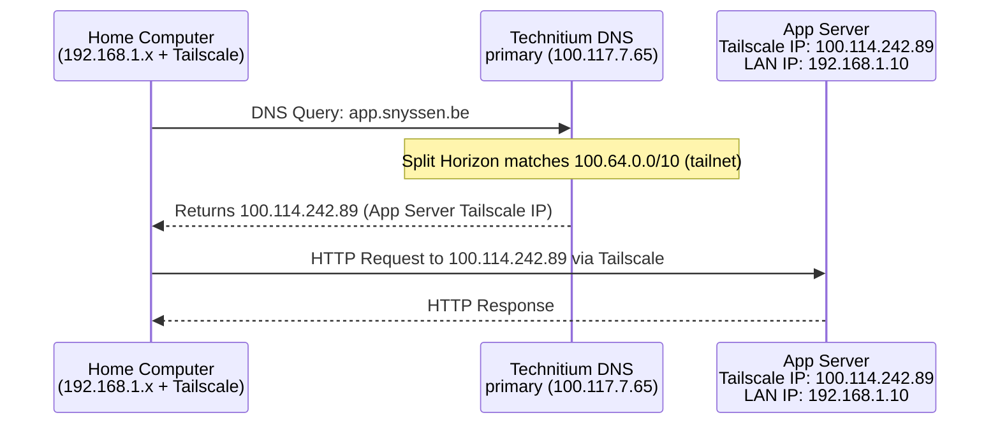

# Network Overview

## DNS Setup

> **Note:** the diagram above predates the Technitium cluster migration and still shows the old
> Adguard Home box. It needs to be redrawn in Excalidraw (`network.excalidraw`) — the text below
> reflects the current setup. The Mermaid diagram below is a draft attempt at an up-to-date
> replacement, kept side by side with the original for comparison until one is picked.

*Legend: thin arrows are DNS traffic, thick arrows are HTTP traffic, the dotted arrow is Technitium's
one-way cluster config/zone sync from primary to secondary. The `Router` node is informational only
(no inbound port is forwarded on it — all external access comes in via the Ingress Server or
Tailscale), matching the crossed-out router in the original diagram.*

This setup ensures that HTTP path is always as direct as possible while ensuring safe access to services.

### DNS servers

DNS resolution (both LAN and tailnet) is handled by a two-node [Technitium DNS](https://technitium.com/dns/)
cluster, defined under `nix/hosts/technitium-primary/` and `nix/hosts/technitium-secondary/` and
configured via the `technitium_dns_setup` Ansible role (`ansible/playbooks/technitium-setup.ansible.yml`):

| Node                  | Role      | Runs on                          | LAN IP        | Tailscale IP  |
| --------------------- | --------- | --------------------------------- | ------------- | ------------- |
| `technitium-primary`  | primary   | bare metal (NUC)                  | `192.168.1.2` | `100.117.7.65` |
| `technitium-secondary`| secondary | VM on `hypervisor` (libvirt)       | `192.168.1.3` | `100.64.88.28` |

Both nodes are joined into a single Technitium cluster (cluster domain `taild023c5.ts.net`). Technitium's
built-in clustering continuously replicates the **primary's** configuration — zones, records, DNS Apps
(including Split Horizon), and blocklists — to the secondary. Replication is **one-way, primary → secondary**:
zones and records must always be edited on `technitium-primary` (via `ansible/hosts/group_vars/technitium/vars.yml`
+ the `technitium-setup` playbook); edits made directly on the secondary are not pushed back and will be
overwritten on the next sync/rejoin.

Each node answers DNS queries independently once its zone data is synced — clustering keeps configuration
in sync, it does not provide a shared virtual IP or automatic query failover. See
[Node failure / failback](#node-failure--failback) for what that means in practice.

### Split-horizon DNS

Both nodes run the Technitium **Split Horizon** DNS App, installed automatically whenever
`technitium_dns_setup_split_records` (in `ansible/hosts/group_vars/technitium/vars.yml`) is non-empty. For
each configured record, Split Horizon inspects the querying client's source IP and returns a different
answer depending on which network range it matches — evaluated in order, first match wins:

- `192.168.1.0/24` (LAN) → the service's LAN IP (e.g. `192.168.1.10` for the app server)
- `100.64.0.0/10` (Tailscale) → the service's tailnet IP (e.g. `100.114.242.89` for the app server)
- `0.0.0.0/0` (catch-all) → used for records that should always resolve to a single address regardless
  of client (e.g. a tailnet-only service, or the public ingress IP as a fallback for external resolvers)

This is what lets the same hostname (e.g. `app.snyssen.be`) resolve to the most direct path for each
client type, as shown in the flows below.

## Connection Flows by Client Type

### 1. Device from Internet (Unknown Device)

### 2. Device from Internet with Tailscale (Personal Laptop)

### 3. Device from LAN (Guest Computer)

### 4. Device from LAN with Tailscale (Home Computer)

Each flow above is drawn against `technitium-primary`, which is what LAN DHCP and the tailnet's
global nameservers point at day-to-day. `technitium-secondary` holds an up-to-date replica of the
same zones (including Split Horizon rules) and answers identically — see below for how to fail
queries over to it.

## Node failure / failback

Technitium's clustering keeps `technitium-secondary`'s configuration in sync with `technitium-primary`,
but it does **not** provide a shared virtual IP or automatic query failover: each node only answers
queries sent directly to it. If `technitium-primary` (the bare-metal NUC) goes down, DNS resolution
continues only for clients that are actually sending queries to `technitium-secondary`. Restoring
resolution is therefore a manual re-pointing exercise, not an automatic cutover.

### 1. Confirm the primary is actually down

- `technitium-primary`'s node-exporter target (`100.117.7.65:9100`, see
  `ansible/hosts/group_vars/apps/vars.yml`) will go red in Grafana/Prometheus.
- Sanity check directly: `dig @192.168.1.2 snyssen.be` (LAN) or `dig @100.117.7.65 snyssen.be` (tailnet).
- Confirm the secondary is healthy and has current data before cutting over:
  `dig @192.168.1.3 snyssen.be` / `dig @100.64.88.28 snyssen.be`.

### 2. Re-point clients at `technitium-secondary`

- **LAN clients:** point them at `192.168.1.3` instead of `192.168.1.2`. If your router/DHCP only
  hands out a single DNS server, update that DHCP option to `192.168.1.3` (or, better, configure it to
  hand out both `192.168.1.2` and `192.168.1.3` in normal operation so OS resolvers already fail over
  on their own). Clients with a hardcoded resolver will need to be edited individually.
- **Tailscale clients:** update the tailnet's *Global Nameservers* in the
  [Tailscale admin console](https://login.tailscale.com/admin/dns) to use `100.64.88.28` instead of (or
  in addition to, for automatic fallback) `100.117.7.65`. This covers MagicDNS-based split-horizon
  resolution for every tailnet device without touching each one individually.
- Because clustering already replicated zones, records, and the Split Horizon app to
  `technitium-secondary`, no DNS config changes are needed on the secondary itself — it will serve the
  same split-horizon answers immediately.

### 3. DHCP (if/when migrated to Technitium)

DHCP is intended to run on `technitium-primary` in production (see the `NOTE` in
`nix/hosts/technitium-primary/configuration.nix`) but scopes are not enabled by default — see the
commented-out `technitium_dns_setup_dhcp_scopes` in `ansible/hosts/group_vars/technitium/vars.yml`.
Technitium does not fail DHCP over automatically either: if the primary is handling DHCP when it goes
down, existing leases keep working until they expire, but new leases will fail until you either bring
the primary back or explicitly enable an equivalent scope on `technitium-secondary`.

### 4. Failback once `technitium-primary` recovers

- Verify the primary rejoins the cluster cleanly (check `Settings → Clustering` in its web UI, or rerun
  `just ansible-playbook playbook=technitium-setup flags='-i hosts/prod.yml'`).
- Because sync is one-way (primary → secondary), any change made *directly* on `technitium-secondary`
  while the primary was down (e.g. a quick manual record fix) is **not** propagated back automatically
  and will be silently overwritten by the next sync. Re-apply any such changes on `technitium-primary`
  (ideally via `ansible/hosts/group_vars/technitium/vars.yml` + the `technitium-setup` playbook) once
  it's back.
- Revert the temporary DNS (and DHCP, if applicable) re-pointing from step 2 back to
  `technitium-primary` once you've confirmed it's healthy.
