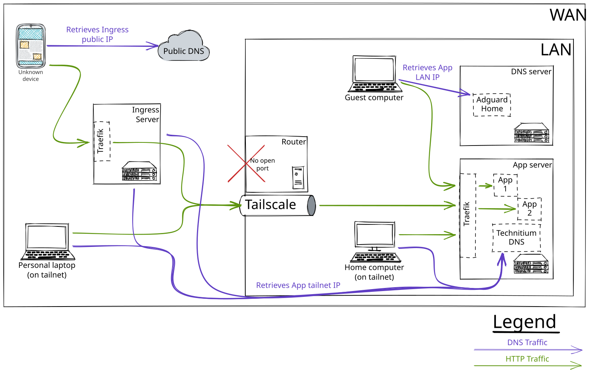
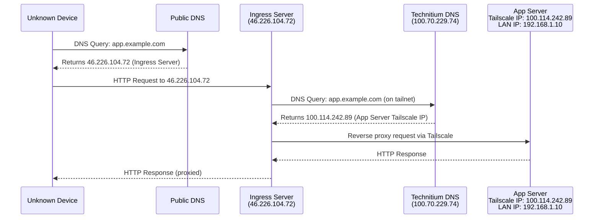
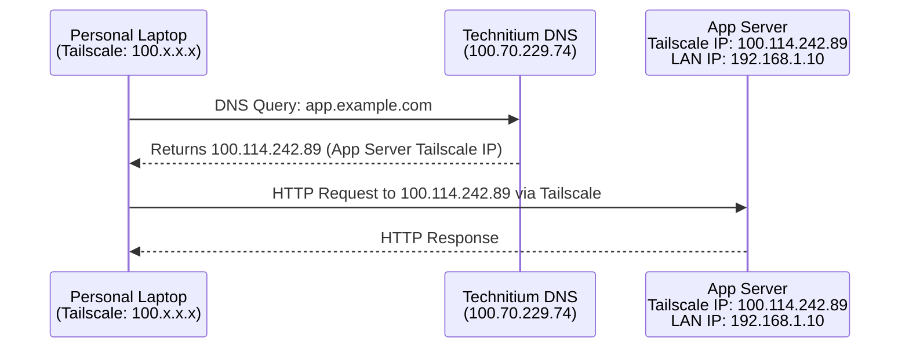
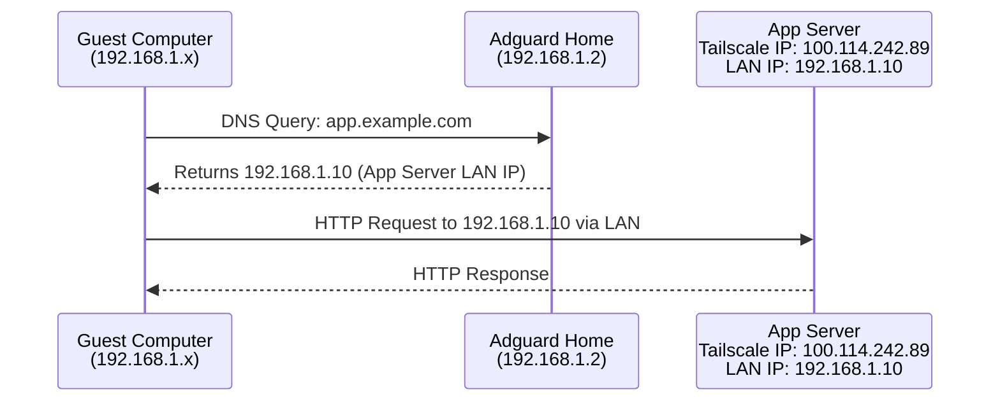
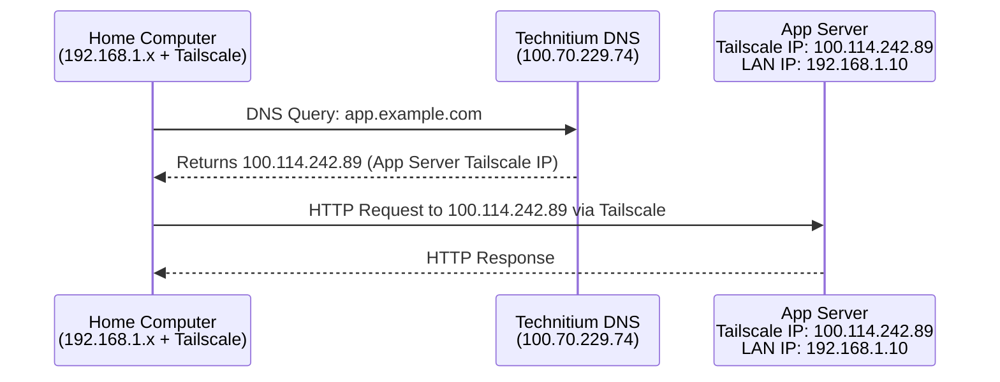

# Network Overview

## DNS Setup

This setup ensures that HTTP path is always as direct as possible while ensuring safe access to services.

## Connection Flows by Client Type

### 1. Device from Internet (Unknown Device)

### 2. Device from Internet with Tailscale (Personal Laptop)

### 3. Device from LAN (Guest Computer)

### 4. Device from LAN with Tailscale (Home Computer)

